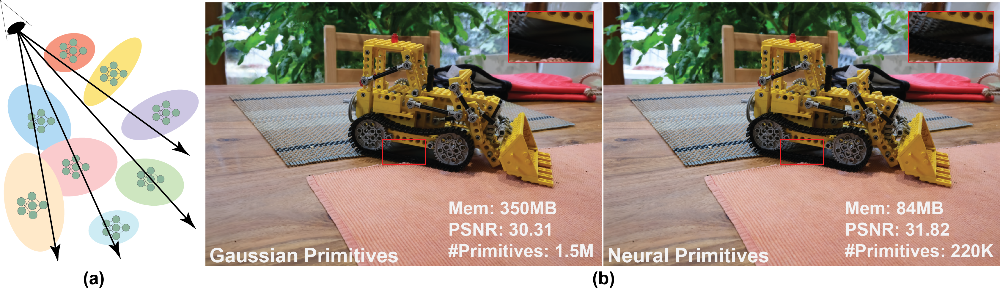

# Splat the Net: Radiance Fields with Splattable Neural Primitives

[](https://arxiv.org/abs/2510.08491) [](https://vcai.mpi-inf.mpg.de/projects/SplatNet/)

This is the official implementation of the paper "Splat the Net: Radiance Fields with Splattable Neural Primitives" (SplatNet for short)



>Abstract:
Radiance fields have emerged as a predominant representation for modeling 3D scene appearance. Neural formulations such as Neural Radiance Fields provide high expressivity but require costly ray marching for rendering, whereas primitive-based methods such as 3D Gaussian Splatting offer real-time efficiency through splatting, yet at the expense of representational power. Inspired by advances in both these directions, we introduce splattable neural primitives, a new volumetric representation that reconciles the expressivity of neural models with the efficiency of primitive-based splatting. Each primitive encodes a bounded neural density field parameterized by a shallow neural network. Our formulation admits an exact analytical solution for line integrals, enabling efficient computation of perspectively accurate splatting kernels. As a result, our representation supports integration along view rays without the need for costly ray marching. The primitives flexibly adapt to scene geometry and, being larger than prior analytic primitives, reduce the number required per scene. On novel-view synthesis benchmarks, our approach matches the quality and speed of 3D Gaussian Splatting while using $10\times$ fewer primitives and $6 \times$ fewer parameters. These advantages arise directly from the representation itself, without reliance on complex control or adaptation frameworks.

## Environment Setup

Our rasterizer is implemented in CUDA, based on the [CUDA implementation](https://github.com/graphdeco-inria/diff-gaussian-rasterization) of 3DGS. We then integrated this rasterizer in the [vol3dgs codebase](https://github.com/chinmay0301ucsd/Vol3DGS) (which was modified from [official 3DGS codebase](https://github.com/graphdeco-inria/gaussian-splatting)) for view synthesis experiments. In case of installation issues, please refer to the [Gaussian Splatting codebase](https://github.com/graphdeco-inria/gaussian-splatting), and the issues/solutions referenced there.

1. Clone the repository recursively, along with the submodules.

```
git clone --recursive https://github.com/huynguyenbao/splat-the-net.git
cd splat-the-net
git submodule update --init --recursive
```

2. Create and activate [Anaconda](https://www.anaconda.com/docs/tools/working-with-conda/environments) environment using the provided `environment.yml` file, and then pip install the other requirements. We tested our code with Python3.9.20, training on a NVIDIA A40 GPU and measuring fps on a NVIDIA RTX 4090. Update the environment.yml file, if you are using a different version of cuda toolkit / pytorch. It should work with higher versions as well.

<!-- 3. 
4.  but make sure to adjust the torch versions in `install.sh` accordingly. -->

```
# environment setup
conda env create -f environment.yml
conda activate splat-the-net

# python package installation
pip3 install -r requirements.txt
pip3 install submodules/simple-knn
pip3 install submodules/fused-ssim
pip3 install submodules/diff-gaussian-rasterization
pip3 install submodules/diff-gaussian-mlp-max-rasterization
```

<!-- 3. Alternatively, if you already have a working 3DGS conda environment, install the following in that environment:
```
pip install slangtorch==1.3.7 wandb matplotlib tqdm
pip install -e submodules/slang-gaussian-rasterization
``` -->

## Dataset Preparation

We use the same dataset format as 3DGS.

### NeRF Synthetic Dataset

- Download nerfsynthetic from [this link](https://www.kaggle.com/datasets/nguyenhung1903/nerf-synthetic-dataset).

  #### Resampled Point Clouds

  - Resampled point clouds with varying numbers of primitives are available [here](https://www.kaggle.com/datasets/nguyenbaohuy311/nerf-synthetic-pointclouds).
  - After downloading, place each `.ply` file into its corresponding scene folder. The recommended structure is:

  ```
      nerf/
      └── chair/
        ├── transforms_train.json
        ├── pointcloud_200.ply
        ├── pointcloud_1000.ply
        └── ...
  ```

### Toy Dataset for Expressivity Demonstration

- Download the dataset from [this link](https://www.kaggle.com/datasets/nguyenbaohuy311/toydatasetsplat-the-net).

### Real Datasets

- MipNeRF360 dataset can be downloaded from [here](https://jonbarron.info/mipnerf360/).
- Tanks and temples, and deepblending datasets from the [3DGS project page](https://repo-sam.inria.fr/fungraph/3d-gaussian-splatting/).
To process a custom dataset, follow the instructions [here](https://github.com/graphdeco-inria/gaussian-splatting?tab=readme-ov-file#processing-your-own-scenes).  

### Directory Layout

Place the datasets into the following folders inside your project:

```
project_root/
├── data/
│   ├── nerf/               # NeRF Synthetic + point clouds
│   ├── toydataset/         # Toydataset
│   ├── 360/                # MipNeRF360
│   ├── db/                 # DeepBlending
│   └── tnt/                # Tanks and Temples
```

## Training

### NeRF Synthetic Dataset

- Run the following script to train the model on synthetic scenes under a constrained budget.
- Set the `n_initial_primitives` argument to match the desired budget value.

```
python3 train_mlp_hb_max.py \
                -s <path to NeRF Synthetic dataset> \
                -m <output_model_paths> \
                --n_initial_primitives <200/1000/2000/50000/100000> \
                --eval \
                --num_cams -1 \
                --densification_interval 200 \
                --densify_from_iter 200_000 \
                --densify_until_iter 200_000 \
                --densify_clone_grad_threshold 1e-5 \
                --densify_split_grad_threshold 1e-5 \
                --min_grad_prune 1e-6 \
                --use_regularizer \
                --regularizer_iter_start 100 \
                --lambda_anisotropy 0.001 \          
```

- Run the following script to train the model on synthetic scenes with unconstrained budget.
- The default initial point cloud size for the experiment is `n_initial_primitives = 2000`

```
python3 train_mlp_hb_max.py \
                -s <path to NeRF Synthetic dataset> \
                -m <output_model_paths> \
                --n_initial_primitives 2000 \
                --eval \
                --num_cams -1 \
                --densification_interval 200 \
                --densify_from_iter 1000 \
                --densify_until_iter 20000 \
                --densify_clone_grad_threshold 1e-5 \
                --densify_split_grad_threshold 1e-5 \
                --min_grad_prune 1e-6 \
                --use_regularizer \
                --regularizer_iter_start 100 \
                --lambda_anisotropy 0.001 \          
```

### Toy Dataset

- Run the following script to train the model on toy dataset scenes.
- The flag `toy_example` is already enable for running toy example mode.

```
python3 train_mlp_hb_max.py \
                -s <path to Toy dataset> \
                -m <output_model_paths> \
                --toy_example \
                --eval \
                --num_cams -1 \
                --densification_interval 200 \
                --densify_from_iter 200_000 \
                --densify_until_iter 200_000 \
                --densify_clone_grad_threshold 1e-5 \
                --densify_split_grad_threshold 1e-5 \
                --min_grad_prune 1e-6 \
                --use_regularizer \
                --regularizer_iter_start 100 \
                --lambda_anisotropy 0.001 \          
```

### Real Datasets

Run the following script to train the model on real scenes.

```
python3 train_mlp_hb_max.py \
                -s <path to COLMAP dataset> \
                -m <output_model_paths> \
                --eval \
                --num_cams -1 \
                --resolution 4 \
```

### Argument Information

<details>
<summary>Important Command Line Arguments for train_mlp_hb_max.py</summary>

#### --source_path / -s

  Path to the source directory containing a COLMAP or Synthetic NeRF data set.

#### --model_path / -m

  Path where the trained model should be stored.

#### --resolution / -r

  Image resolution downsample factor.

#### --white_background / -w

  Whether use white background.

#### --eval

  Whether use evaluation mode.

#### --sh_degree

  Degree used in Spherical Harmonics (SH).

#### --n_initial_primitives

  By default, it is off. Used to choose the point cloud size in the initialization step. Only enable when doing budget analysis.

#### --toy_example

  By default, it is off. Only enable when doing experessivity analysis.

#### --iterations

  Number of iterations to run optimization. Default is `100_000`

#### --densification_interval
  
  Performing densification every `x` iterations.

#### --densify_from_iter

  Starting densification at `x-th` iteration. Set it to be larger than `iterations` to disable densification.

#### --densify_until_iter

  Stopping densification at `x-th` iteration.

#### --densify_clone_grad_threshold

  Primitives whose MLP gradient magnitudes above this threshold will be cloned.

#### --densify_split_grad_threshold

  Primitives whose MLP gradient magnitudes above this threshold will be split.

#### --min_grad_prune

  Primitives whose MLP gradient magnitudes below this threshold will be pruned.

#### --lambda_anisotropy

  Weight of the anisotropy loss that penalizes extremely skew primitives.

#### --use_regularizer

  Used to enable regularizers, including anisotropy loss.

#### --regularizer_iter_start

  Including regularizers at `x-th` iteration.

</details>

## Rendering and Evaluation

For rendering, and evaluating metrics, use `render.py` and `metrics.py`, which are adopted as is from the 3DGS codebase with minor modifications.

To render the scene, please run the following script:

```
python3 render.py -m <output_model_path> --iteration best --skip_train
```

To obtain fps, please run the following script:

```
python3 eval_fps.py -m <output_model_path> --iteration best --skip_train
```

To obtain numerical metrics (LPIPS, PSNR and SSIM), please run the following script:

```
python3 metrics.py -m <output_model_paths> 
```

## Produce Benchmark Results

To obtain benchmark results reported in the paper for real scenes, please run the following script:

```
bash scripts/train_real_datasets.sh
bash scripts/eval_quality_real_datasets.sh
bash scripts/eval_fps_real_datasets.sh
```

## Citation

If you find our work and code useful, please cite this work and ⭐ the repo. Feel free to reach us (<xzhou@mpi-inf.mpg.de>, <bnguyen@mpi-inf.mpg.de>) if you have any suggestions regarding this work/ code.

```@article{zhou2025splat,
  title={Splat the Net: Radiance Fields with Splattable Neural Primitives},
  author={Zhou, Xilong and Nguyen, Bao-Huy and Magne, Lo{\"\i}c and Golyanik, Vladislav and Leimk{\"u}hler, Thomas and Theobalt, Christian},
  journal={arXiv preprint arXiv:2510.08491},
  year={2025}
}
```

## Acknowledgements

We thank the authors of [Deformable Beta Splatting](https://rongliu-leo.github.io/beta-splatting/) for supporting performance measurement.
